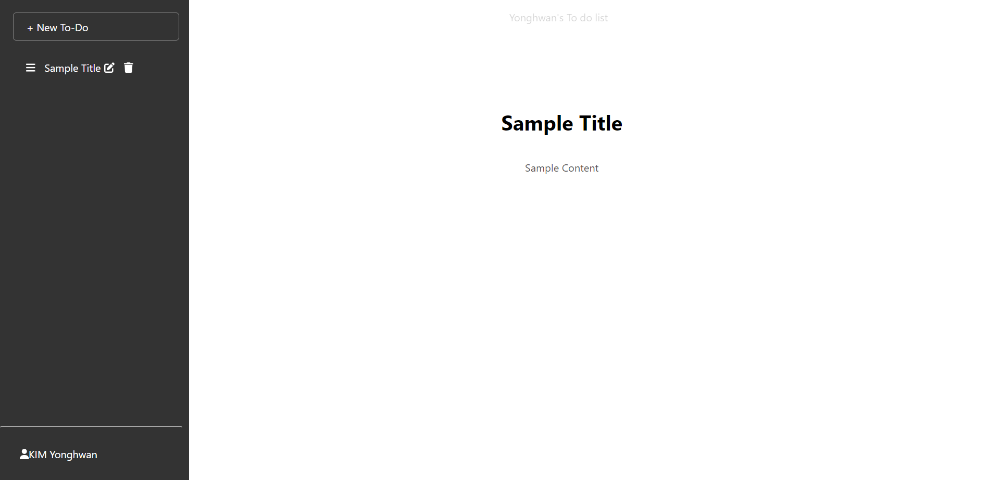
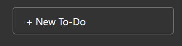
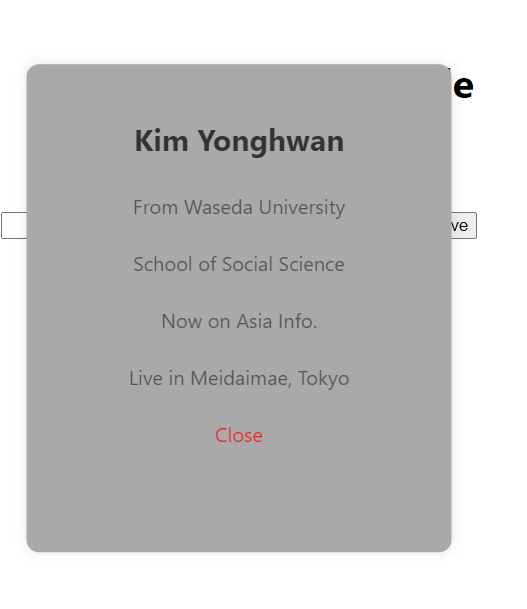

# Only use React(Front)
## Can CRUD(Create, Read, Update, Delete)

### All-page

Can use like blog 

Can create new document by click this button

Can write title and input and if you clicked send button, you can create new document

Can check your title and document

If you clicked your Information, see your details but it is check only the dev's information.

Look my Information!! :)